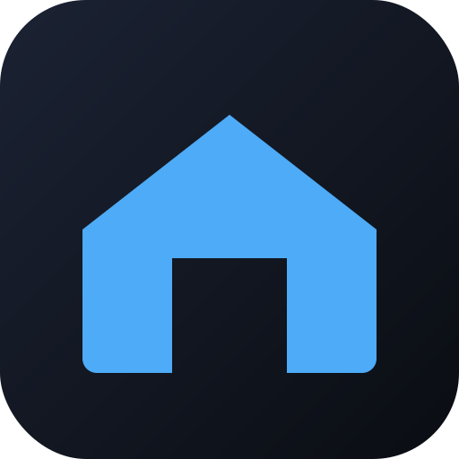

> [🇬🇧 English](README.md) | 🇩🇪 Deutsch

<p align="center">
  
</p>

# hmip-dashboard-plugin

📦 **[hmip-dashboard-plugin-1.1.1.tar.gz herunterladen](https://github.com/fabiorenner-hub/hmip-hcu-dashboard/releases/latest/download/hmip-dashboard-plugin-1.1.1.tar.gz)** — Installation in HCUweb über *Entwicklermodus → Plugins → Aus Datei installieren*.

GitHub: <https://github.com/fabiorenner-hub/hmip-hcu-dashboard>

Lokal gehostetes Web-Dashboard für die Homematic IP Anlage, ausgeliefert als
HCU-Plugin. Nach der Installation erreichbar unter
`http://hcu1-XXXX.local:8080` (oder dem konfigurierten Port).

## Spenden

Wenn dir dieses Plugin hilft, freue ich mich über eine kleine Spende — sie
hält bei mir die Lichter an, während ich weitere HCU-Plugins baue:
[Spenden via PayPal](https://www.paypal.com/donate/?hosted_button_id=JPZRATUUHRT5C).

## Was das Dashboard zeigt

- **Übersicht**: offene Fenster/Türen, aktive Alarme, Licht an, aktive Steckdosen,
  Gesamtleistung, Geräte mit niedriger Batterie oder nicht erreichbar
- **Räume**: pro Raum Klima (Ist-/Soll-Temperatur, Luftfeuchte, Boost,
  Fenster-offen-Flag), Kontakte, Licht und Steckdosen, Rollläden, Sensoren
- **Fenster & Türen**: konsolidierte Liste mit Raumzuordnung
- **Klima**: Klimakarten je geheiztem Raum mit Sollwert-Slider
- **Licht & Steckdosen**: Toggle / Dimmer-Slider
- **Rollläden**: Slider 0..1 (0 = offen, 1 = geschlossen)
- **Sicherheit**: Rauchmelder, Bewegungs-/Präsenzsensoren, Wassersensoren
- **Wartung**: Geräteanzahl, Batterie- und Erreichbarkeits-Warnungen

Alle Werte kommen live über `HmipSystemEvent`, ohne Polling.
Statusänderungen erscheinen innerhalb einer Sekunde im UI.

## Auf der HCU installieren

1. Aktuelle `hmip-dashboard-plugin-<version>.tar.gz` aus den
   [Releases](https://github.com/fabiorenner-hub/hmip-hcu-dashboard/releases) holen.
2. In HCUweb *Entwicklermodus → Plugins → Aus Datei installieren* öffnen und hochladen.
3. Plugin konfigurieren und im Browser
   `http://hcu1-XXXX.local:<port>` öffnen.

## Selbst bauen

Benötigt Docker + buildx auf einem Rechner mit LAN-Zugang zur HCU.

```bash
cd hmip-dashboard-plugin
chmod +x build.sh
./build.sh
```

Erzeugt `hmip-dashboard-plugin-<version>.tar.gz`.

## Voraussetzungen

- Homematic IP HCU1 mit Firmware 1.4.7+

## Konfiguration (HCUweb Plugin-Dialog)

| Feld            | Typ  | Default     | Beschreibung                              |
| --------------- | ---- | ----------- | ----------------------------------------- |
| Port            | int  | 8080        | TCP-Port der Web-UI                       |
| Titel           | Text | Smart Home  | Wird in Browser-Tab und Kopfzeile gezeigt |
| Steuerung erlauben | enum | true     | `false` = read-only (Kiosk-Modus)         |

Speichern lädt den HTTP-Server automatisch neu. Die HCU mappt den
Container-Port 1:1 auf die LAN-Schnittstelle.

## Remote entwickeln

```env
HMIP_HCU_HOST=hcu1-XXXX.local
HMIP_HCU_AUTH_TOKEN=<dev-token>
WEB_PORT=8080
LOG_LEVEL=debug
```

```bash
npm install
npm run dev
# -> http://localhost:8080
```

## Sicherheit

Das Dashboard läuft ohne Authentifizierung im lokalen Netz. Wenn dein LAN
auch für Gäste offen ist, *Steuerung erlauben* auf `false` setzen oder die
HCU hinter einen Reverse-Proxy mit Basic-Auth stellen (nicht Teil des Plugins).

## Herausgeber

Herausgegeben von **Fabio Renner**.

## Lizenz

Apache-2.0
